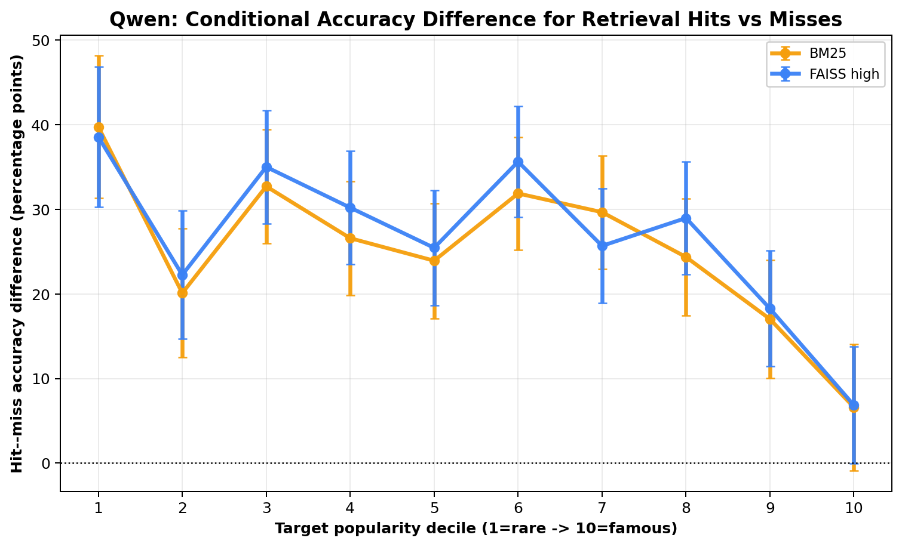

# Popularity Effects in Knowledge-Aware Retrieval Systems

**Amon Sisowath**<br>
TUM / Ai Agentic Retrieval<br>
Munich, Germany<br>
amon.sisowath@berkeley.edu

## Abstract

Retrieval-Augmented Generation (RAG) can address gaps in language models' parametric knowledge, particularly for long-tail facts, but retrieval quality may itself vary with entity popularity. We evaluate BM25+ and FAISS-based dense retrieval across six benchmarks over the fixed `facebook/kilt_wikipedia` `2019-08-01` corpus. Wikipedia page views averaged over 2020-2024 provide an external popularity measure. We use chunk-weighted popularity deciles for the main performance analysis and equal-article deciles for an exposure analysis of wrong retrieved chunks.

On 48,559 target rows, BM25+ MRR@10 falls from 0.652 (95% CI [0.637, 0.668], n=2,806) in the lowest chunk-weighted decile to 0.256 ([0.246, 0.265], n=6,000) in the highest. FAISS high declines less steeply, from 0.586 ([0.570, 0.603]) to 0.415 ([0.405, 0.426]); consequently, the FAISS-minus-BM25 gap changes from -0.066 to +0.160. In a separate 6,058-row depth-100 diagnostic, BM25+ Recall@1 falls from 0.482 to 0.157, while Recall@100 is similar at 0.801 and 0.786. A conditional query-level model supports the proposed ranking mechanism: among 4,433 queries whose target appears in the top 100, adding the number of non-target chunks within 5% of the best target score reduces the absolute popularity coefficient by 43.9%.

Wrong top-10 chunk positions are strongly popularity-skewed relative to equal article exposure, but their distribution is generally much closer to an analytical random-chunk baseline in the middle and upper target deciles. This shows that chunk exposure explains a substantial part of the skew without requiring direct scorer preference. Generation partially masks retrieval differences. Qwen substring accuracy with BM25+ falls from 0.648 to 0.491 across endpoint deciles, whereas zero-shot accuracy rises from 0.316 to 0.431. Rare entities therefore remain more retrieval-dependent. Improving long-tail RAG requires attention to index construction and retrieval quality as well as generation.

## 1. Introduction

Large language models (LLMs) perform strongly on many knowledge-intensive tasks that require factual knowledge [chowdhery2022palm; yu2022]. Nevertheless, their parametric knowledge is uneven: LLMs can struggle with infrequent and long-tail facts [sun-etal-2024-head; mallen2023trust] and become outdated as the world changes [jang2022knowledge; kasai2022temporal]. These limitations are especially consequential in factual question answering and other settings where correctness depends on accurate and current information.

Retrieval-Augmented Generation (RAG) mitigates limitations of parametric memory by retrieving evidence from an external corpus and providing it as context to a language model [lewis2020rag]. When this evidence is relevant and reliable, RAG can reduce hallucination, incorporate up-to-date information, and lessen reliance on knowledge stored solely in model parameters [shuster2021retrieval; kasai2022temporal]. Its effectiveness, however, depends on the retriever finding appropriate evidence.

Popularity is a central factor in this process. LLMs memorize popular facts more reliably than long-tail facts [kandpal2022large; mallen2023trust; sun-etal-2024-head]. Similar popularity-related limitations appear in retrieval: Sciavolino et al. [sciavolino2021entity] find that DPR performs worse on entity-centric questions about uncommon entities.

Prior work establishes that retrievers generally perform better for head entities than for tail entities and offers partial explanations in specific settings. However, the mechanisms underlying this gap have not been comprehensively characterized at scale across retrieval methods, benchmarks, and popularity levels. We investigate how target-side lexical evidence, lexical competition, and dense representation strength relate to these performance patterns. We also examine what replaces the target when retrieval fails and how much of the resulting popularity skew is associated with chunk-level index exposure.

We distinguish two concepts:

- **Exposure effects** arise from corpus and index structure. Articles that contribute more chunks receive more opportunities to appear among retrieved results. If popular articles are longer and contribute more chunks, incorrect retrievals can be skewed toward them even without a direct popularity preference in the scoring function.
- **Residual retrieval effects** are differences between observed retrieval outcomes and the distribution predicted by chunk-level exposure. Such differences may reflect lexical overlap, semantic relevance, entity ambiguity, topic, question difficulty, or learned representations. They should not automatically be interpreted as direct scorer-level popularity preference.

We address three research questions:

1. **RQ1:** How does target-article popularity relate to sparse and dense retrieval performance, and which lexical or representational characteristics are associated with these differences?
2. **RQ2:** How does the popularity of incorrectly retrieved chunks compare with article-level and chunk-level exposure baselines?
3. **RQ3:** How do popularity-related retrieval differences affect downstream answer accuracy when generators can also rely on parametric knowledge?

We evaluate retrieval over a fixed 2019 Wikipedia corpus using six Wikipedia-linked benchmarks: FEVER, HotpotQA, Natural Questions, T-REx, and TriviaQA from KILT [petroni2021kilt], plus PopQA [mallen2023trust]. The benchmarks mix naturally occurring questions, human-authored questions and claims, and structured factual queries. They are not a representative production query log.

The fully recorded main dense system uses `Lajavaness/bilingual-embedding-small`. The repository mentions `intfloat/multilingual-e5-small` and `intfloat/multilingual-e5-large`, but no complete, comparable result artifacts for those models were found; we therefore do not claim them as evaluated main systems. Downstream generation uses GPT-Neo-2.7B [black2021gptneo] and Qwen2.5-7B-Instruct [yang2024qwen25].

## 2. Related Work

### Popularity bias in parametric knowledge

LLMs store factual knowledge unevenly: they answer questions about popular entities and frequently observed facts more reliably than questions concerning long-tail knowledge [kandpal2022large; mallen2023trust; sun-etal-2024-head]. Scaling improves performance primarily on popular facts and does not eliminate this head-tail gap [mallen2023trust]. Retrieval augmentation is therefore particularly appealing for rare entities, where parametric knowledge is least reliable. An open question is whether retrieval mitigates this gap or introduces additional popularity-dependent disparities of its own.

### Popularity-dependent retrieval performance

Sciavolino et al. [sciavolino2021entity] provide early evidence that the head-tail gap extends to retrieval. On EntityQuestions, DPR performs substantially worse for uncommon entities, whereas BM25 is comparatively less sensitive to entity frequency. Their analysis relates part of this degradation to question patterns observed during training. The remaining gap could reflect unequal corpus exposure, lexical competition, or ranker-level effects, and the work does not characterize the documents retrieved when the target is missed.

### Retriever behavior under entity ambiguity

Chen et al. [chen2021popularity] study a complementary setting in which multiple entities share the same name. Using AmbER, they show that retrievers perform worse on tail entities that share a name with a more popular entity. Their entity-confusion analysis finds that retrievers more often rank a document for another same-name entity above the gold document for tail-entity queries.

This controlled setting is informative, but it does not identify how much of the gap is explained by target-side lexical evidence, competition from plausible same-name documents, the number of chunks contributed by each entity, or learned ranker representations. Our work analyzes the distribution of retrieved errors and compares observed retrieval behavior with article- and chunk-level exposure baselines.

### Retrieval errors and downstream generation

RAG combines retrieved evidence with a model's parametric knowledge [lewis2020rag]. Retrieval is especially beneficial for long-tail facts, for which parametric knowledge is less reliable [mallen2023trust]. Retrieval does not guarantee factual generation, however. Irrelevant, incorrect, or conflicting evidence can mislead the generator. Hong et al. [hong-etal-2024-gullible] show that retrieval-augmented models are brittle to conflicting retrieved information even when it appears relevant.

### Focus of this work

Prior work provides partial explanations for head-tail retrieval gaps but does not comprehensively characterize them across retrieval methods, benchmarks, and popularity levels. We examine which chunks are retrieved in error, test the roles of lexical competition and corpus exposure, and measure how popularity-dependent retrieval errors relate to downstream factual generation. In particular, we test whether parametric knowledge can mask retrieval failures for popular entities while rare entities remain dependent on correct retrieved evidence.

## 3. Methodology

### 3.1 Focus and task

We study an open-domain RAG pipeline over a fixed Wikipedia corpus. Given a question-target row, a retriever ranks indexed Wikipedia passage chunks. Retrieval relevance is evaluated at the article level: a chunk is relevant when its `wikipedia_id` equals the row's scalar target article ID. Recall@k is one when at least one such chunk occurs in the first k positions and zero otherwise. MRR@10 uses the reciprocal of the first matching one-based chunk rank and assigns zero when no target chunk occurs in the stored top 10.

This implementation detail matters for KILT examples with multiple provenance articles. During dataset conversion, each distinct provenance article becomes a separate question-target row with the same question ID. Retrieval success is therefore evaluated separately for each provenance article; it is not an OR over all gold articles and does not require all gold articles. HotpotQA two-document cases are likewise evaluated as separate target rows rather than as joint multi-hop successes. The target row's article determines popularity, the wrong-retrieval comparison, and relevance. This differs from the more common "retrieve any gold article" formulation and is a limitation of the current artifacts.

### 3.2 Popularity and corpus exposure

We use Wikipedia page views as an external proxy for public visibility, following Mallen et al. [mallen2023trust]. Specifically, we average monthly page views from 2020 through 2024. This is an article-level visibility measure rather than the frequency of a queried fact, and it does not directly measure representation in retriever or generator training data.

The popularity window postdates the 2019 retrieval snapshot. We therefore interpret page views as a later measure of general public visibility, not contemporaneous corpus exposure. Events after 2019 may change particular articles' measured popularity.

The corpus contains 5,903,530 unique Wikipedia rows, of which 5,890,044 have nonnegative popularity metadata. Metadata-based recursive splitting at 1,000 characters with 100-character overlap predicts 24,651,978 chunks. The actual BM25 index contains 22,064,752 fixed-width character chunks because BM25 slices text directly, whereas the dense index uses recursive character splitting and therefore has different boundaries. This distinction was omitted in the original draft.

For the main retrieval and generation analyses, we use chunk-weighted popularity deciles. Articles are sorted by popularity and weighted by their metadata-derived recursive chunk count when boundaries are selected. The resulting corpus chunk counts per decile are 2,463,538; 2,465,757; 2,466,181; 2,465,179; 2,465,263; 2,465,226; 2,465,236; 2,465,160; 2,465,230; and 2,465,208. Each group therefore contains approximately one tenth of metadata-derived index mass, although BM25's actual fixed-slice chunk distribution is not identical.

For the wrong-retrieval exposure analysis, we use equal-article deciles, not chunk-weighted deciles. This is necessary to contrast equal article exposure with the actual chunk distribution. The corpus contributes 676,826 chunks in equal-article decile 1 and 7,893,188 in decile 10.


### 3.3 Benchmarks and evaluation pools

We evaluate PopQA, Natural Questions, TriviaQA, FEVER, HotpotQA, and T-REx [mallen2023trust; petroni2021kilt]. PopQA is loaded from its test split. For the KILT datasets, the conversion notebook combines the original train, validation, and test splits. TriviaQA question text is matched back to `trivia_qa/unfiltered.nocontext` by ID. FEVER claims and T-REx KILT input strings are used directly as generation prompts; no task-specific verbalization is added.

Examples are first shuffled with seed 42. Within each popularity decile, each of the six datasets contributes at most `target_per_decile / 6` rows: 133 for the nominal 8k target and 1,000 for the nominal 60k target. Underfilled dataset-decile groups contribute all available rows and their unused quota is not redistributed. We therefore call the artifacts the **small-target pool** and **large-target pool**, rather than "8k" and "60k."

| Dataset | Small unique questions | Large unique questions |
|---|---:|---:|
| FEVER | 1,064 | 5,451 |
| HotpotQA | 1,325 | 9,675 |
| Natural Questions | 1,212 | 6,403 |
| PopQA | 1,330 | 9,702 |
| T-REx | 1,329 | 9,953 |
| TriviaQA | 1,123 | 6,007 |
| **Total unique question IDs** | **7,383** | **47,191** |
| **Question-target rows used by pipelines** | **7,383** | **48,559** |

The large pool has more rows than unique question IDs because multi-provenance examples are represented once per target. The small and large artifacts are not nested: only 3,674 of the small pool's 7,383 `(question_id, wikipedia_id)` pairs occur in the large pool. This appears to result from independently materialized caches and must be considered when comparing diagnostics across pools.

Pool usage is as follows:

- Large-target pool, 48,559 target rows: BM25+ and FAISS high MRR@10, wrong top-10 chunk analysis, and all reported generation tables.
- Small-target pool excluding HotpotQA, 6,058 target rows: BM25+ depth-100 recall and competition diagnostics.
- Analogue set: 38 manually constructed candidate pairs, of which 27 have complete nonzero BM25 scores and 26 have complete nonzero dense scores.

### 3.4 Corpus construction and chunking

The retrieval corpus is `facebook/kilt_wikipedia`, configuration `2019-08-01`, split `full`. Each article's structured `text.paragraph` list is joined with newline characters. KILT markers such as `Section::::` and `BULLET::::` remain in the text, so section headings and lists are retained when present. Tables are retained only insofar as they occur in KILT's paragraph representation. Article titles are metadata and are not explicitly prepended to indexed text. No additional lowercasing, Unicode normalization, punctuation normalization, or whitespace canonicalization is applied at corpus-construction time.

The 2019 pipeline has no redirect-resolution or redirect-filtering step. BM25 chunks are direct 1,000-character slices with a 100-character overlap and may cross section boundaries. Dense chunks are produced by LangChain's `RecursiveCharacterTextSplitter` with the same nominal size and overlap. Neither path explicitly filters short final chunks; empty source text produces no BM25 chunks and is handled by the splitter's default behavior for dense retrieval.

### 3.5 BM25 retrieval

Sparse retrieval uses `bm25s` 0.3.8 [bm25s]. The checked BM25+ index uses `k1=1.5`, `b=0.75`, `delta=1.0`, and the `bm25+` method and IDF formula. Scoring is over word tokens, not raw characters. Documents are lowercased and tokenized with the Unicode regular expression `(?u)\b\w\w+\b`; punctuation acts as a separator and one-character tokens are dropped. English stop words from `bm25s.stopwords.STOPWORDS_EN` are removed before PyStemmer's English stemmer is applied. Queries use the corresponding `bm25s.tokenize(..., stopwords="en", stemmer=English)` path. Titles are not separately indexed.

The no-length-normalization robustness configuration uses the same BM25+ setup with `b=0.0`. Its qualitative trend exists in repository caches, but a complete decile table from a common, collision-safe cohort was not available and is not reported as a confirmatory test here.

### 3.6 Dense retrieval

The reported main dense system, **FAISS high**, uses `Lajavaness/bilingual-embedding-small` (384 dimensions) with `nprobe=256`. The system is multilingual even though the benchmarks are English because the project initially targeted a shared multilingual retrieval stack; no English-only encoder comparison was run, so this choice should not be interpreted as optimal for these benchmarks.

The checked binary FAISS artifact is an IVF-PQ index with 4,096 lists, **64 subquantizers**, 8-bit codes, and L2 distance. This corrects the draft's unsupported claim of 48 subquantizers. The service is configured to apply `query: {query}` and `passage: {passage}` templates and requests normalized embeddings. However, the checked index was produced through a migration path and neither the model revision nor the exact normalization behavior is recorded in its metadata. The local Hugging Face construction path also does not forward the normalization option. Consequently, prefix and normalization claims for the persisted vectors cannot be independently verified from the final artifact.

Current index-building code accumulates at most 500,000 training vectors and trains after reaching `nlist * 39 = 159,744` vectors. The checked migrated index has 24,806,534 FAISS positions, including 159,744 training positions that have no corresponding SQLite document; retrieval over-fetches and skips missing document positions. There are 24,646,790 mapped document positions. Model revisions/checkpoint commit hashes were not pinned.

The repository also names E5-small and E5-large, but the active pipeline and the figures reported here use only bilingual-embedding-small. Comparable E5 result tables are unavailable and should not be claimed until those runs are completed.

### 3.7 Generation and evaluation

For retrieval-augmented generation, the top three retrieved chunks are concatenated in retrieval-rank order with a newline separator. Both generators receive the same textual content:

```text
Documents: {documents}


Question: {question}
```

Qwen receives this text as a single user chat message; GPT-Neo receives it as a raw completion prompt. The zero-shot condition uses the same template with an empty `Documents` field.

We evaluate `EleutherAI/gpt-neo-2.7B` and `Qwen/Qwen2.5-7B-Instruct`; revisions are unpinned. Both generate at most 256 new tokens. GPT-Neo uses `do_sample=False` and truncates the input to 1,792 tokens so the input plus generation fits its 2,048-token position limit. Qwen's wrapper does not explicitly set sampling, temperature, an input context limit, or truncation; it relies on the Hugging Face model/pipeline defaults. Although the service constructors record `temperature=0.0`, that value is not passed to either generation pipeline.

The primary evaluator is case-insensitive substring matching. It lowercases the generated answer and each accepted answer and returns correct if any nonempty accepted answer occurs verbatim as a substring. It performs no punctuation, article, accent, or whitespace normalization. KILT answer strings are taken from all nonempty `output.answer` fields; TriviaQA also retains the original answer value, while PopQA retains only the first normalized possible answer.

The repository contains a binary judge implementation using `mistralai/Mistral-7B-Instruct-v0.2`. Its prompt asks whether the proposed answer is factually correct and directly responsive according to the full gold article text and requires a JSON `verdict` and `reasoning`. However, complete large-pool binary result parquets and a human-agreement study are unavailable. We therefore do not report binary-judge accuracy or agreement and do not use the binary judge to support the conclusions.

### 3.8 Confidence intervals and statistical tests

Unless stated otherwise, retrieval, recall, and generation intervals are unadjusted 95% normal-approximation intervals computed as the sample mean plus or minus `1.96 * s / sqrt(n)` over question-target rows. No bootstrap was used. Thus there is no question-level bootstrap, and the intervals do not account for repeated natural-language questions with multiple target rows.

Wrong-retrieval intervals use the binomial normal approximation `p +/- 1.96 * sqrt(p(1-p)/n)` over wrong chunk positions. These intervals treat up to ten chunks from the same query as independent and are therefore likely too narrow; clustered question-level bootstrap intervals should replace them in a final submission.

The analogue diagnostic uses a paired two-sided Wilcoxon signed-rank test after replacing zero sentinels, which mean that the target was absent from the scoring depth, with missing values. We report the paired mean difference with a t-based 95% interval, Cohen's paired `d_z`, and rank-biserial correlation. No correction for multiple comparisons is applied because the two tests are prespecified diagnostics, but this choice should be considered when interpreting the dense result.

## 4. Findings

### 4.1 Popularity affects sparse and dense retrieval differently

#### Exact MRR@10 results

Table 1 reports aggregate MRR@10 across all six datasets. Each value is `estimate [95% CI]`; `n` is the number of question-target rows. Deciles are chunk-weighted, with D1 rarest and D10 most popular.

**Table 1. MRR@10 by retrieval system and chunk-weighted popularity decile.**

| Decile | n | BM25+ MRR@10 [95% CI] | FAISS high MRR@10 [95% CI] |
|---:|---:|---:|---:|
| 1 | 2,806 | 0.652 [0.637, 0.668] | 0.586 [0.570, 0.603] |
| 2 | 3,229 | 0.501 [0.485, 0.516] | 0.490 [0.474, 0.505] |
| 3 | 3,438 | 0.442 [0.427, 0.457] | 0.474 [0.458, 0.489] |
| 4 | 4,103 | 0.422 [0.408, 0.435] | 0.462 [0.448, 0.475] |
| 5 | 5,088 | 0.421 [0.409, 0.432] | 0.467 [0.454, 0.479] |
| 6 | 5,895 | 0.406 [0.395, 0.417] | 0.465 [0.454, 0.476] |
| 7 | 6,000 | 0.385 [0.375, 0.396] | 0.461 [0.450, 0.472] |
| 8 | 6,000 | 0.363 [0.352, 0.373] | 0.449 [0.438, 0.460] |
| 9 | 6,000 | 0.324 [0.314, 0.334] | 0.441 [0.430, 0.452] |
| 10 | 6,000 | 0.256 [0.246, 0.265] | 0.415 [0.405, 0.426] |
| **All** | **48,559** | **0.395 [0.391, 0.399]** | **0.463 [0.459, 0.466]** |

BM25+ decreases by 0.397 from D1 to D10 (95% CI for the independent endpoint difference [-0.415, -0.379]). FAISS high decreases by 0.171 ([-0.191, -0.151]). The paired FAISS-minus-BM25 gap is -0.066 in D1 and +0.160 in D10; the endpoint change in that gap is +0.226 ([0.207, 0.245]). Dense retrieval is therefore not invariant to popularity, but it degrades substantially less than BM25+ and overtakes it above the lowest deciles.


The checked retrieval CSVs have repeated question-ID blocks and 12 fewer top-10 blocks than large-pool rows. The values above reproduce the repository's published plotting semantics, which join on `question_id`. An occurrence-aware sensitivity calculation gives lower aggregate MRR@10 values of 0.384 for BM25+ and 0.451 for FAISS high. The direction of the comparison is unchanged, but the collision-safe pipeline should be rerun before archival publication.

### 4.2 BM25 failures increasingly occur near the top of the ranking

The depth-100 diagnostic is available only for the 6,058-row small-pool cohort excluding HotpotQA. Table 2 reports `estimate +/- 95% normal half-width`; the value in parentheses is the standard error.

**Table 2. BM25+ Recall@1, @10, @50, and @100 by chunk-weighted decile.**

| Decile | n | Recall@1 | Recall@10 | Recall@50 | Recall@100 |
|---:|---:|---:|---:|---:|---:|
| 1 | 357 | 0.482 +/- 0.052 (0.026) | 0.711 +/- 0.047 (0.024) | 0.773 +/- 0.044 (0.022) | 0.801 +/- 0.041 (0.021) |
| 2 | 502 | 0.369 +/- 0.042 (0.022) | 0.572 +/- 0.043 (0.022) | 0.651 +/- 0.042 (0.021) | 0.689 +/- 0.041 (0.021) |
| 3 | 617 | 0.329 +/- 0.037 (0.019) | 0.580 +/- 0.039 (0.020) | 0.681 +/- 0.037 (0.019) | 0.723 +/- 0.035 (0.018) |
| 4 | 646 | 0.350 +/- 0.037 (0.019) | 0.576 +/- 0.038 (0.019) | 0.684 +/- 0.036 (0.018) | 0.714 +/- 0.035 (0.018) |
| 5 | 649 | 0.308 +/- 0.036 (0.018) | 0.582 +/- 0.038 (0.019) | 0.687 +/- 0.036 (0.018) | 0.723 +/- 0.034 (0.018) |
| 6 | 646 | 0.316 +/- 0.036 (0.018) | 0.568 +/- 0.038 (0.020) | 0.687 +/- 0.036 (0.018) | 0.724 +/- 0.034 (0.018) |
| 7 | 655 | 0.292 +/- 0.035 (0.018) | 0.568 +/- 0.038 (0.019) | 0.681 +/- 0.036 (0.018) | 0.733 +/- 0.034 (0.017) |
| 8 | 660 | 0.223 +/- 0.032 (0.016) | 0.533 +/- 0.038 (0.019) | 0.670 +/- 0.036 (0.018) | 0.720 +/- 0.034 (0.017) |
| 9 | 662 | 0.225 +/- 0.032 (0.016) | 0.538 +/- 0.038 (0.019) | 0.669 +/- 0.036 (0.018) | 0.725 +/- 0.034 (0.017) |
| 10 | 664 | 0.157 +/- 0.028 (0.014) | 0.505 +/- 0.038 (0.019) | 0.733 +/- 0.034 (0.017) | 0.786 +/- 0.031 (0.016) |
| **All** | **6,058** | **0.294 +/- 0.011 (0.006)** | **0.566 +/- 0.012 (0.006)** | **0.689 +/- 0.012 (0.006)** | **0.732 +/- 0.011 (0.006)** |

The D10-minus-D1 difference is -0.325 for Recall@1 (95% CI [-0.384, -0.266]), -0.207 for Recall@10 ([-0.267, -0.146]), -0.040 for Recall@50 ([-0.095, 0.015]), and -0.015 for Recall@100 ([-0.067, 0.037]). Thus the endpoint difference is large at shallow ranks but no longer distinguishable from zero at depths 50 and 100. This supports a ranking-stage interpretation, although D2-D9 show that the trend is not strictly monotonic at deep cutoffs.


### 4.3 Lexical competition predicts BM25 failure beyond popularity

Popular targets have more chunks and stronger target-side lexical evidence, while mean query-term IDF decreases. These parallel trends alone do not establish that competition accounts for BM25 failure. We therefore fit a query-level model using the existing small-pool artifacts.

The primary outcome is Recall@1. Because `near_ties_5pct` requires a target score, the model conditions on the 4,433 of 6,058 queries for which at least one target chunk appears in the top 100. The specification is:

```text
logit P(Recall@1 = 1) =
    intercept
    + log10(article popularity)
    + mean query IDF
    + log2(target article chunks)
    + log2(non-target near ties within 5% + 1)
    + dataset fixed effects.
```

All nested models use the same complete cases and HC1 robust standard errors; FEVER is the reference dataset. The IDF variable is a TF-IDF proxy fitted on sampled corpus documents rather than the exact BM25 index IDF.

**Table 3. Conditional logistic models of BM25+ Recall@1. Coefficients are followed by robust SE in parentheses.**

| Predictor | M0: popularity + dataset | M1: + IDF and chunks | M2: + near ties |
|---|---:|---:|---:|
| log10(popularity) | -0.495 (0.032), p<.001 | -0.324 (0.043), p<.001 | -0.182 (0.065), p=.005 |
| Mean query IDF | - | 0.087 (0.037), p=.020 | -0.033 (0.055), p=.547 |
| log2(target chunks) | - | -0.164 (0.027), p<.001 | 0.064 (0.042), p=.133 |
| log2(near ties + 1) | - | - | -1.086 (0.029), p<.001 |
| AIC | 5,670.6 | 5,633.4 | 2,915.9 |
| McFadden pseudo-R2 | 0.053 | 0.060 | 0.515 |

Adding near-tie competition improves fit over M1 by likelihood-ratio chi-square(1)=2,719.47, p<10^-592. Each doubling of `near_ties + 1` is associated with an odds ratio of 0.337 (95% CI [0.319, 0.357]), a 66.3% reduction in the odds of Recall@1. The popularity coefficient attenuates by 43.9%, from -0.324 (95% CI [-0.408, -0.240]) to -0.182 ([-0.309, -0.055]). A target-article-clustered sensitivity analysis gives the same adjusted popularity coefficient with SE=0.077, p=.018, and 3,971 article clusters.

Queries that miss at rank 1 have a mean of 54.4 near-tied non-target chunks (n=2,649), compared with 4.44 for hits (n=1,784). The point-biserial correlation is r=-0.618, p<10^-464. These results are consistent with lexical competition explaining a substantial portion, but not all, of the popularity gradient.

This is not a causal mediation analysis. Near ties are a post-retrieval diagnostic constructed from the same scores that determine rank, and conditioning on top-100 target presence excludes 1,625 failures. The model characterizes ranking after candidate retrieval rather than unconditional retrieval success.


### 4.4 Dense analogue diagnostic

The stored analogue artifact contains 38 proposed pairs, not 50. Zero means that the target was absent from the scorer's retrieval depth and is treated as missing. This leaves 27 complete BM25 pairs and 26 complete dense pairs.

**Table 4. Paired analogue results. Difference is older/known minus newer analogue.**

| Metric | Paired n | New mean | Known mean | Mean difference [95% CI] | Cohen dz | Rank-biserial | Wilcoxon W | p |
|---|---:|---:|---:|---:|---:|---:|---:|---:|
| BM25 score | 27 | 30.573 | 31.836 | 1.263 [-2.496, 5.022] | 0.133 | 0.074 | 175 | .750 |
| Dense cosine | 26 | 0.896 | 0.908 | 0.0123 [0.0026, 0.0219] | 0.513 | 0.675 | 57 | .00178 |

The paired BM25 difference is not significant, whereas dense similarity is higher for the older/known side. This is consistent with more separable representations for historically represented entities, but it is not evidence of a causal effect of popularity. Pair labels require further manual validation, and entity age, topic, article quality, and training exposure remain confounded.


### 4.5 Wrong-retrieval popularity skew and exposure baselines

The wrong-retrieval analysis inspects every stored top-10 chunk position. For each target row, a position is wrong when its retrieved article ID differs from the row's scalar target article ID. The unit `r` in the preference equation is therefore a **wrong retrieved chunk position**, not only the top-ranked wrong chunk and not a deduplicated article:

```text
Pref(d) = mean[ popularity(retrieved wrong chunk's source article)
                > popularity(target article) ].
```

Duplicate chunks and multiple chunks from the same source article are retained. BM25+ and FAISS high are both evaluated. Target groups are equal-article popularity deciles.

The random baselines are analytical, not Monte Carlo. Let `p_j` be the corpus share of articles or chunks in equal-article decile `j`. For target decile `d`, the implementation computes:

```text
B_d = sum_{j > d} p_j + 0.5 * p_d.
```

The one-half within-decile term approximates the probability that a random item in the same decile is more popular. Baselines are conditioned on target decile only, not the target's exact popularity. No sampling, replacement procedure, or random seed is involved.

**Table 5. Probability that a wrong top-10 chunk comes from a more popular article. Observed intervals are 95% binomial normal intervals; baselines are analytical.**

| Target decile | BM25+ observed [CI], n wrong chunks | FAISS high observed [CI], n wrong chunks | Random article | Random chunk |
|---:|---:|---:|---:|---:|
| 1 | 0.917 [0.910, 0.924], 5,500 | 0.854 [0.845, 0.863], 5,558 | 0.950 | 0.986 |
| 2 | 0.882 [0.876, 0.889], 9,429 | 0.814 [0.806, 0.821], 9,529 | 0.850 | 0.955 |
| 3 | 0.848 [0.842, 0.854], 13,200 | 0.791 [0.784, 0.798], 13,379 | 0.750 | 0.916 |
| 4 | 0.810 [0.804, 0.816], 16,898 | 0.734 [0.728, 0.741], 17,195 | 0.650 | 0.865 |
| 5 | 0.766 [0.760, 0.771], 22,217 | 0.686 [0.680, 0.692], 22,526 | 0.550 | 0.803 |
| 6 | 0.697 [0.692, 0.703], 27,059 | 0.616 [0.611, 0.622], 27,405 | 0.450 | 0.730 |
| 7 | 0.658 [0.654, 0.663], 43,035 | 0.606 [0.602, 0.611], 43,522 | 0.350 | 0.643 |
| 8 | 0.552 [0.548, 0.556], 63,946 | 0.508 [0.504, 0.512], 64,887 | 0.250 | 0.537 |
| 9 | 0.438 [0.435, 0.441], 93,460 | 0.415 [0.412, 0.419], 94,982 | 0.150 | 0.399 |
| 10 | 0.220 [0.218, 0.222], 181,788 | 0.220 [0.218, 0.222], 182,543 | 0.050 | 0.160 |

The observed curves are not uniformly closest to the random-chunk baseline. In the two lowest target deciles, BM25+ is closer to the equal-article expectation, and FAISS high lies below both baselines. From approximately D3 upward, however, both observed curves are generally much closer to random-chunk exposure than to equal-article exposure. At D9, for example, BM25+ is 0.039 from the chunk baseline but 0.288 from the article baseline; FAISS high is 0.016 from the chunk baseline but 0.265 from the article baseline. At D10, both observed systems exceed the chunk baseline by about 0.060 and the article baseline by about 0.170.

These results show that unequal chunk exposure explains a substantial portion of wrong-result popularity skew, especially for middle- and high-popularity targets. They do not show that scoring is independent of popularity. Deviations may reflect lexical overlap, semantic similarity, ambiguity, topic, question difficulty, or scorer behavior.


A full observed target-decile by wrong-document-decile transition matrix can be generated by the repository notebook, but a collision-safe numerical matrix was not persisted. It is therefore not reported here. Recomputing it after assigning unique row IDs is preferable to publishing the current many-to-many `question_id` join.

### 4.6 Generation compresses the retrieval gap

Generation uses the large-target pool and substring evaluation. All rows have a score. The common per-decile counts are 2,806; 3,229; 3,438; 4,103; 5,088; 5,895; 6,000; 6,000; 6,000; and 6,000, for 48,559 total target rows. Each table cell is accuracy with a 95% normal interval.

**Table 6. GPT-Neo-2.7B substring accuracy by retriever and chunk-weighted popularity decile.**

| Retriever | D1 | D2 | D3 | D4 | D5 | D6 | D7 | D8 | D9 | D10 | All |
|---|---|---|---|---|---|---|---|---|---|---|---|
| Zero-shot | .110 [.099,.122] | .085 [.076,.095] | .088 [.079,.098] | .073 [.065,.081] | .061 [.055,.068] | .062 [.056,.068] | .055 [.049,.061] | .057 [.051,.063] | .066 [.060,.072] | .084 [.077,.091] | .071 [.069,.073] |
| BM25+ top 3 | .377 [.359,.395] | .329 [.313,.345] | .330 [.314,.346] | .325 [.310,.339] | .327 [.314,.340] | .308 [.296,.319] | .298 [.286,.310] | .302 [.290,.314] | .289 [.277,.300] | .237 [.226,.248] | .305 [.301,.309] |
| FAISS high top 3 | .389 [.371,.407] | .353 [.336,.369] | .346 [.331,.362] | .333 [.319,.348] | .337 [.324,.350] | .318 [.306,.330] | .318 [.306,.330] | .321 [.309,.333] | .318 [.306,.329] | .339 [.327,.351] | .333 [.328,.337] |
| FAISS nprobe=1024 top 3 | .392 [.374,.410] | .365 [.349,.382] | .354 [.338,.370] | .344 [.329,.358] | .345 [.332,.358] | .323 [.311,.335] | .324 [.312,.336] | .323 [.311,.335] | .322 [.310,.334] | .343 [.331,.355] | .339 [.334,.343] |

**Table 7. Qwen2.5-7B-Instruct substring accuracy by retriever and chunk-weighted popularity decile.**

| Retriever | D1 | D2 | D3 | D4 | D5 | D6 | D7 | D8 | D9 | D10 | All |
|---|---|---|---|---|---|---|---|---|---|---|---|
| Zero-shot | .316 [.299,.333] | .255 [.240,.271] | .275 [.260,.289] | .261 [.248,.274] | .266 [.254,.278] | .274 [.262,.285] | .280 [.269,.291] | .315 [.303,.327] | .349 [.337,.361] | .431 [.418,.443] | .308 [.304,.312] |
| BM25+ top 3 | .648 [.631,.666] | .546 [.529,.563] | .545 [.528,.561] | .520 [.504,.535] | .522 [.508,.536] | .479 [.466,.491] | .473 [.460,.485] | .467 [.454,.479] | .458 [.445,.470] | .491 [.479,.504] | .502 [.498,.507] |
| FAISS high top 3 | .614 [.596,.632] | .559 [.542,.576] | .559 [.542,.575] | .543 [.528,.558] | .551 [.538,.565] | .512 [.500,.525] | .492 [.480,.505] | .493 [.480,.505] | .498 [.485,.511] | .524 [.511,.536] | .526 [.522,.530] |
| FAISS nprobe=1024 top 3 | .623 [.605,.641] | .572 [.555,.589] | .575 [.558,.591] | .554 [.539,.569] | .556 [.543,.570] | .515 [.502,.527] | .501 [.488,.513] | .496 [.483,.508] | .498 [.486,.511] | .526 [.513,.538] | .532 [.527,.536] |

For Qwen, BM25+ accuracy decreases by 0.157 between endpoint deciles (95% CI [-0.179, -0.135]), while FAISS high decreases by 0.090 ([-0.112, -0.068]). Zero-shot accuracy increases by 0.115 ([0.093, 0.136]). GPT-Neo has much weaker zero-shot accuracy; BM25+ decreases by 0.140 ([-0.161, -0.119]), while FAISS high decreases by 0.051 ([-0.072, -0.029]). These endpoint intervals combine the independently estimated D1 and D10 standard errors.

These trends are consistent with generation masking retrieval failure more effectively for popular knowledge. The hit-versus-miss comparison in the accompanying figure is observational: successfully retrieved questions may be easier for other reasons, so its difference is not a causal retrieval effect.




## 5. Limitations

### Popularity as an article-level proxy

Page views measure public visibility of a Wikipedia article rather than frequency of the individual fact queried. The 2020-2024 window also postdates the 2019 corpus snapshot. The reported comparisons are descriptive associations, not causal effects of popularity.

### Correlated article and question properties

Popularity correlates with article length, chunk count, entity age and type, topic, aliases, and question difficulty. Chunk-weighted deciles equalize metadata-derived aggregate chunk mass, not these other properties. The conditional BM25 model strengthens the competition account but cannot establish causal mediation.

### Pool identity and repeated targets

The small and large pools are not nested. Multi-provenance KILT questions are expanded into separate target rows, and the large retrieval CSVs use non-unique `question_id` values. Current plotting code can therefore create many-to-many joins. Headline values reproduce the stored analysis semantics, but occurrence-aware sensitivity analyses give slightly lower aggregate MRR. Future runs should assign a unique ID to every question-target row and evaluate both any-gold and all-required-gold criteria.

### Corpus and index mismatch

BM25 and FAISS use different chunk boundary algorithms despite sharing nominal chunk size and overlap. Chunk-weighted deciles are based on recursive metadata chunking and do not exactly equalize BM25's fixed-slice index mass. The migrated FAISS index also contains unmapped training positions. These facts limit direct sparse-dense attribution.

### Approximate dense retrieval

The dense system uses approximate IVF-PQ search. No exact `IndexFlat` comparison has yet tested whether approximation error changes by popularity decile. Model revisions, the persisted index's exact normalization path, and comparable E5-small/E5-large runs are also unavailable.

### Wrong-retrieval uncertainty

The wrong-retrieval analysis counts chunk positions without article deduplication, and its intervals ignore within-query clustering. The analytical baselines condition on decile rather than exact target popularity. A final analysis should use unique row IDs, report clustered or question-bootstrap intervals, and include the complete target-to-wrong-decile transition matrix.

### Generation attribution and judging

Article-level relevance does not guarantee that a retrieved chunk contains the answer-bearing passage. Hit-miss generation comparisons are associational. The binary judge has not been completed on the large pool and has not been validated against human labels. The Qwen decoding wrapper also relies on unpinned model defaults.

### Unrun robustness experiments

The existing artifacts do not provide an exposure-controlled counterfactual index, exact flat-FAISS comparison, contemporaneous 2019 page-view analysis, alternative chunking scheme, answer-bearing passage recall, or no-context/wrong-context/correct-context/oracle-context generation intervention. These are future experiments, not completed results.

## 6. Conclusion

This paper documents two distinct popularity-related retrieval patterns. First, BM25+ MRR@10 declines sharply with target popularity, while FAISS high declines more modestly and changes from trailing BM25+ in the lowest decile to leading it in the highest. The depth-100 BM25 diagnostic shows that the largest endpoint disparity occurs at shallow ranks. A conditional query-level model provides stronger evidence for the proposed mechanism: near-scoring non-target competition strongly predicts rank-1 failure and attenuates the popularity coefficient by 43.9%, although a residual association remains.

Second, the popularity distribution of wrong top-10 chunks is substantially closer to a random-chunk exposure baseline than to a random-article baseline across most middle and upper target deciles. Unequal chunk exposure therefore explains a substantial portion of apparent preference for popular wrong results, although it does not explain every decile or rule out relevance- and scorer-related effects.

The practical consequence concerns long-tail reliability. Popular questions are increasingly answerable from Qwen's parametric knowledge even without retrieval, whereas retrieval-augmented accuracy for rare questions is much higher than zero-shot accuracy. Evaluating only final answers can therefore hide retrieval-stage disparities. Improving long-tail RAG requires attention to index construction, row-level evaluation integrity, and retrieval quality, not only to the generator.

## 7. Future Work

The highest-priority next experiment is exposure-controlled retrieval: cap each article at a fixed number of chunks, sample a fixed number of chunks per article, or retrieve at article level, then recompute the wrong-result transition matrix. This would test the exposure mechanism directly rather than only comparing observed errors with analytical baselines.

A second priority is exact dense-search validation on a manageable subset. Comparing IVF-PQ with normalized flat search by popularity decile would determine whether approximate-search error contributes to the dense trend.

Further work should report standard BM25 and a grid over `k1`, `b`, and `delta`; repeat popularity measurement with contemporaneous 2019 page views; validate and expand the analogue pairs; evaluate answer-bearing passage recall; and run the same questions under no, wrong, retrieved-target, and oracle-target context. Binary or human evaluation should be completed with measured agreement.

## References

- Arabzadeh, N., and Clarke, C. L. A. 2025. *Benchmarking LLM-based Relevance Judgment Methods*. arXiv:2504.12558.
- Black, S., Gao, L., Wang, P., Leahy, C., Biderman, S., et al. 2021. *GPT-Neo: Large Scale Autoregressive Language Modeling with Mesh-Tensorflow*. Zenodo.
- Chen, A., Gudipati, P., Longpre, S., Ling, X., and Singh, S. 2021. *Evaluating Entity Disambiguation and the Role of Popularity in Retrieval-Based NLP*. ACL-IJCNLP 2021.
- Chowdhery, A., Narang, S., Devlin, J., et al. 2022. *PaLM: Scaling Language Modeling with Pathways*. arXiv:2204.02311.
- Conneau, A., Khandelwal, K., Goyal, N., et al. 2020. *Unsupervised Cross-lingual Representation Learning at Scale*. ACL 2020.
- Hong, G., Kim, J., Kang, J., Myaeng, S.-H., and Whang, J. J. 2024. *Why So Gullible? Enhancing the Robustness of Retrieval-Augmented Models against Counterfactual Noise*. Findings of NAACL 2024.
- Jang, J., Ye, S., Lee, C., et al. 2022. *TemporalWiki: A Lifelong Benchmark for Training and Evaluating Ever-Evolving Language Models*. EMNLP 2022.
- Kandpal, N., Deng, H., Roberts, A., Wallace, E., and Raffel, C. 2022. *Large Language Models Struggle to Learn Long-Tail Knowledge*. arXiv:2211.08411.
- Kasai, J., Sakaguchi, K., Takahashi, Y., et al. 2022. *REALTIME QA: What's the Answer Right Now?* NeurIPS 2022.
- Lewis, P., Perez, E., Piktus, A., et al. 2020. *Retrieval-Augmented Generation for Knowledge-Intensive NLP Tasks*. NeurIPS 2020.
- Lu, X. H. 2024. *BM25S: Orders of Magnitude Faster Lexical Search via Eager Sparse Scoring*. arXiv:2407.03618.
- Mallen, A., Asai, A., Zhong, V., Das, R., Khashabi, D., and Hajishirzi, H. 2023. *When Not to Trust Language Models: Investigating Effectiveness of Parametric and Non-Parametric Memories*. ACL 2023.
- Petroni, F., Piktus, A., Fan, A., et al. 2021. *KILT: a Benchmark for Knowledge Intensive Language Tasks*. NAACL-HLT 2021.
- Reimers, N., and Gurevych, I. 2019. *Sentence-BERT: Sentence Embeddings using Siamese BERT-Networks*. EMNLP-IJCNLP 2019.
- Robertson, S., and Zaragoza, H. 2009. *The Probabilistic Relevance Framework: BM25 and Beyond*. Foundations and Trends in Information Retrieval 3(4):333-389.
- Sciavolino, C., Zhong, Z., Lee, J., and Chen, D. 2021. *Simple Entity-Centric Questions Challenge Dense Retrievers*. EMNLP 2021.
- Shuster, K., Poff, S., Chen, M., Kiela, D., and Weston, J. 2021. *Retrieval Augmentation Reduces Hallucination in Conversation*. Findings of EMNLP 2021.
- Sun, K., Xu, Y., Zha, H., Liu, Y., and Dong, X. L. 2024. *Head-to-Tail: How Knowledgeable Are Large Language Models (LLMs)?* NAACL-HLT 2024.
- Thakur, N., Reimers, N., Daxenberger, J., and Gurevych, I. 2021. *Augmented SBERT: Data Augmentation Method for Improving Bi-Encoders for Pairwise Sentence Scoring Tasks*. NAACL 2021.
- Wang, L., Yang, N., Huang, X., Yang, L., Majumder, R., and Wei, F. 2024. *Multilingual E5 Text Embeddings: A Technical Report*. arXiv:2402.05672.
- Yang, A., Yang, B., Zhang, B., et al. 2024. *Qwen2.5 Technical Report*. arXiv:2412.15115.
- Yu, W., Iter, D., Wang, S., et al. 2022. *Generate Rather than Retrieve: Large Language Models are Strong Context Generators*. arXiv:2209.10063.
